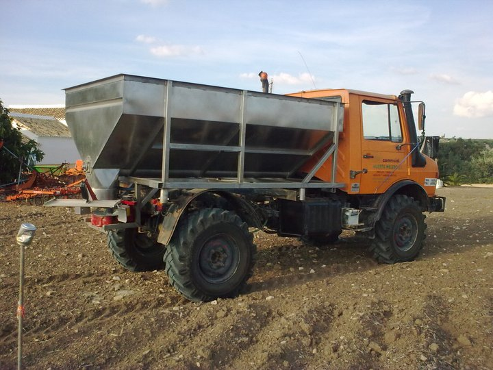

!SLIDE center
#punto de partida#
 * poco tiempo
 * ni idea de montar nada...
 * ...pero sabemos hacer algo

!SLIDE center
##paso 1##
#la idea#

!SLIDE center 
#quote I#

 * Good Friend: To be honest, the main problem I think people have is that they don't have experience of other industries

 * Good Friend: in other industries there are 1000's of opportunities

!SLIDE center
#quote II#
 * Good Friend: but Geeks are very closed minded

 * Good Friend: so we tend to make stuff for ourselves

 * Good Friend: that is #FAIL

!SLIDE center
#quote y III#

 * javi.santana: i'm going to put your quote in my slides 

 * Good Friend: lol. If I see another Twitter analytics, or so on app, I'M GOING TO BURN MY FUCKING ROUTER

!SLIDE center gilipollez
##tópico 1##
#necesito pasta $$$#

!SLIDE center
##paso 2##
#desarrollo#
##eficiencia##

!SLIDE center gilipollez
##tópico 2##
#no tengo tiempo#

!SLIDE center
##paso 3##
#vender#

!SLIDE center
#¡que salgas a vender!#
##pierde el miedo##

!SLIDE center gilipollez
##tópico 3##
#papeleo, facturas, empresas, blabla#

!SLIDE center gilipollez
##tópico 4##
#no soy comercial#

!SLIDE center
##paso 4##
#Clientes#
##(empieza lo duro)##

!SLIDE center

!SLIDE center

!SLIDE center
##paso 5##
#Mejorar#
(eficiencia, de nuevo)

!SLIDE center
##y 6##
#¿crecer?#

!SLIDE center corte
#¿ya?#
(no)

!SLIDE center 
#más difícil todavía#
##tienes mucho menos tiempo##
##ser **realmente** eficiente##

!SLIDE center 
#ser eficiente#
# = #
#decir NO#

!SLIDE center 
#ser eficiente#
# = #
#centrarte#

!SLIDE center 
#ser eficiente#
# = #
#eliminar problemas#

!SLIDE center 
#ser eficiente#
# = #
#equipo alineado#

!SLIDE center 
#ser eficiente#
# = #
#mantenerte pequeño#

!SLIDE center 
#ser eficiente#
# = #
#gasto al mínimo#

!SLIDE center 
#ser eficiente#
# = #
#no pensar mucho#

!SLIDE center

!SLIDE center

!SLIDE center corte
#conclusiones#

!SLIDE center 
#Haz algo#
##y##
#vendelo#

!SLIDE center big
#trabajo#

!SLIDE center 
#gracias#
##http://agroguia.es##
##@javisantana##
